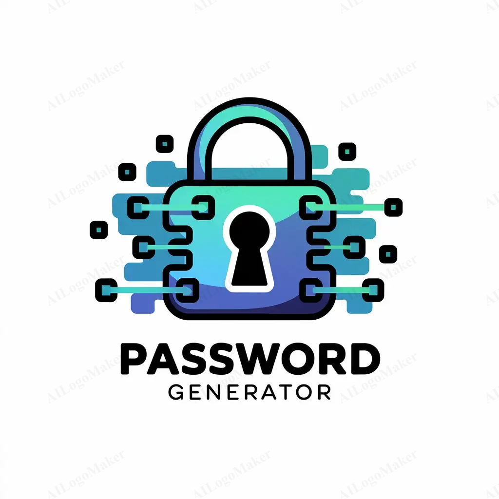

# Password Generator Sample

<p align="left">

</p>

A sample password generator written in Python that supports multiple password generation strategies. Whether you need a random password with symbols and numbers, a memorable passphrase using real words, or a simple PIN code, this tool has you covered.

## 🚀 Features

- **Random Password Generation**: Create secure passwords with customizable length and character sets
- **Memorable Password Generation**: Generate human-readable passphrases using real English words
- **PIN Code Generation**: Create numeric PIN codes of any length
- **Flexible Configuration**: Customize all aspects of password generation
- **Object-Oriented Design**: Clean, extensible architecture using abstract base classes
- **NLTK Integration**: Uses the Natural Language Toolkit for authentic word-based passwords

## 📁 Project Structure

```
pass_generator/
├── README.md                 # Project documentation
├── requirements.txt          # Python dependencies
├── assets/                   # Project assets
│   └── banner.png           # Project banner image
└── src/                     # Source code directory
    ├── main.py              # Main password generator classes
```

## 🛠️ Installation

### Prerequisites

- Python 3.7 or higher
- pip (Python package installer)

### Step-by-Step Installation

1. **Clone the repository** (or download the source code):
   ```bash
   git clone https://github.com/alireza-fllh/password_generator.git
   cd password_generator
   ```

2. **Install dependencies**:
   ```bash
   pip install -r requirements.txt
   ```

3. **Verify installation** by running a quick test:
   ```bash
   python src/main.py
   ```

   This should generate and display a sample password.


## 📋 Requirements

### System Requirements

- **Operating System**: Windows, macOS, or Linux
- **Python Version**: 3.7 or higher
- **Memory**: Minimal (< 50MB)
- **Storage**: < 100MB (including NLTK word corpus)

### Python Dependencies

- **nltk** (3.9.1): Natural Language Toolkit for word corpus access

### Installation Notes

- On first run, NLTK will automatically download the required word corpus (~10MB)
- Internet connection required for initial NLTK data download
- No additional system dependencies required

## ☑️ Testing
The `main.py` script also includes test cases for each password generator. The script will print out a test password for each generator and run checks to make sure the password matches the expected format.

## 🔗 Links

- **Repository**: [https://github.com/alireza-fllh/password_generator](https://github.com/alireza-fllh/password_generator)
